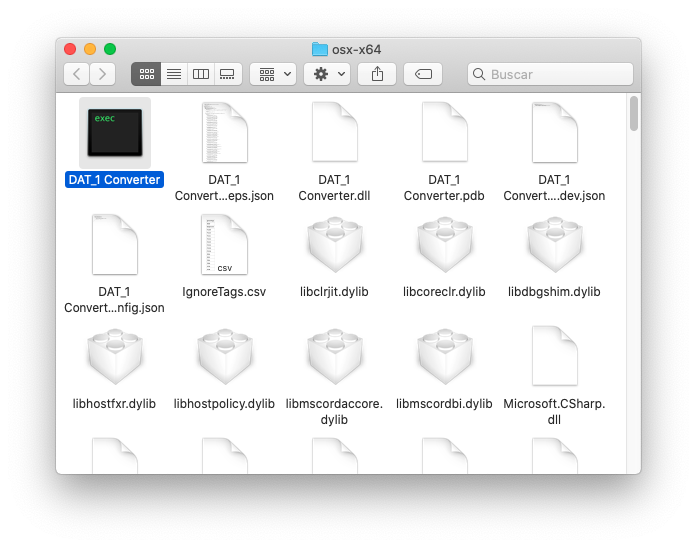
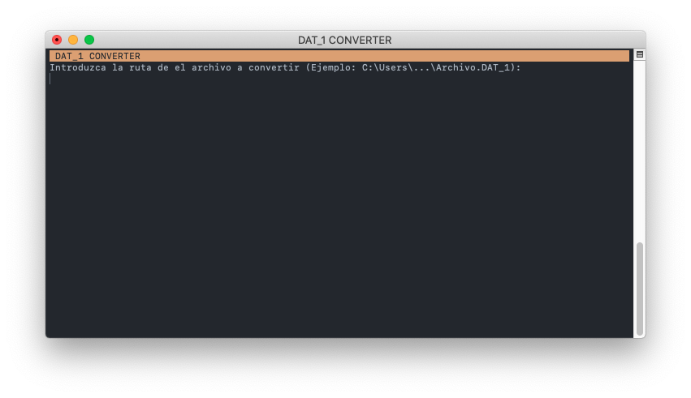
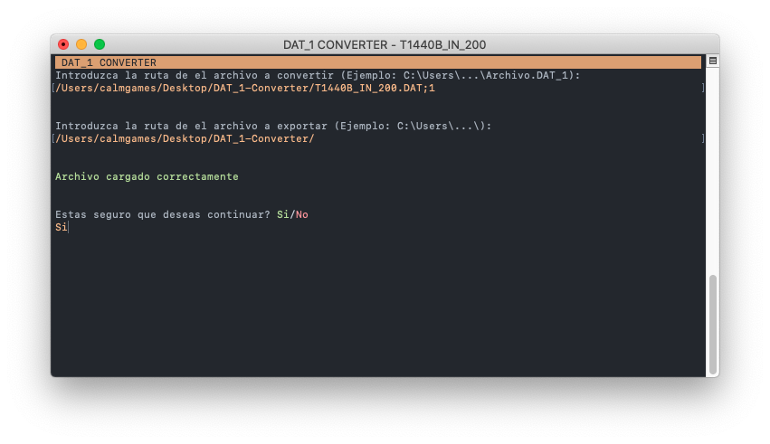
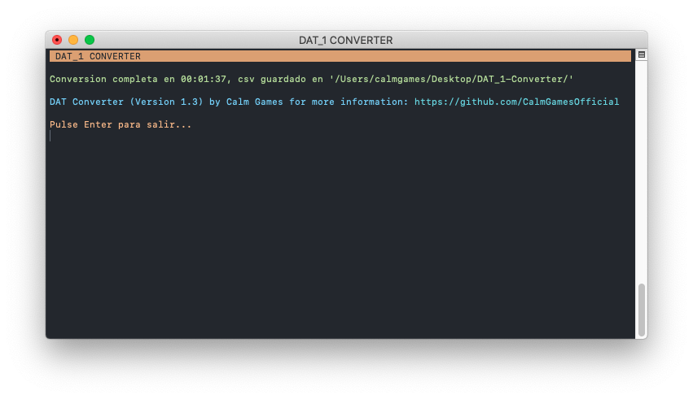
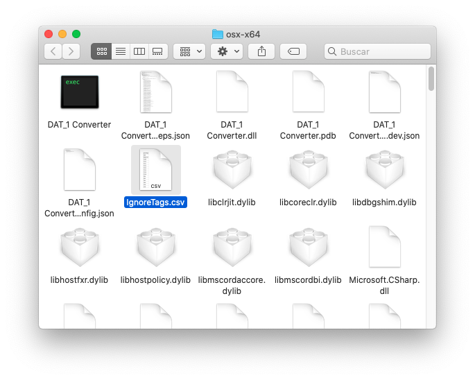
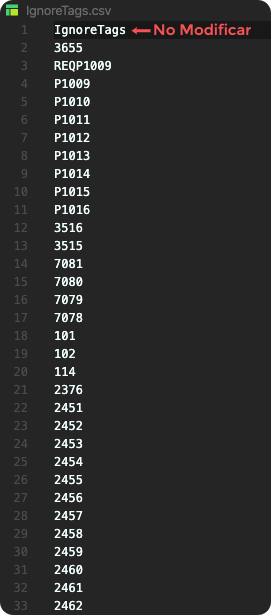

# DAT Converter

## Dependencias
para usar esta aplicacion necesitas un ordenador de [64-Bits](https://es.wikipedia.org/wiki/64_bits) y [netcore 3.1 (o posterior)](https://dotnet.microsoft.com/download/dotnet-core/3.1).

## Instalacion
1. Ve a la pestaña de [Releases](https://github.com/CalmGamesOfficial/DAT-Converter/releases).

2. Descarga la version mas reciente para el sistema operativo que tengas
 _(Si quieres descargar directamente la ultima version para windows haz click [aqui](https://github.com/CalmGamesOfficial/DAT-Converter/releases/download/1.4/Windows.zip))_.

3. Descomprime el archivo Zip y lanza el ejecutable ya sea desde la terminal o haciendo doble click en el.

  

## Como se usa 
1. Primero introduce la ruta de el archivo a convertir _(ya sea arrastrando el archivo o manualmente)_.

  

2. Luego introduce el directorio donde quieres exportar el archivo.

  

3. Por ultimo introduce ``si`` y pulsa **enter** para hacer la conversion, tras unos minutos finalizara la conversion.

    _(la duracion dependera de la velocidad de su procesador y del tamaño del archivo que estes  convirtiendo)_.

  

## Como editar Ignore Tags
En la version [1.3](https://github.com/CalmGamesOfficial/DAT-Converter/releases/tag/1.3) (y posteriores) se ha incluido la opcion de poder eliminar tags a la hora de convertir de esta forma no se cuelan tags erroneos en el csv.

Para editar este archivo simplemente tiene que ir a donde haya guardado el programa y abrir el archivo ``IgnoreTags.csv`` con su editor de texto favorito.

  

Aqui ya puede editar a su gusto los tags que quiere excluir de la conversion en el orden que quiera siempre que __no modifique la primera linea__.

  

Luego guarde el archivo y ya puede convertir sin problemas. :smile:

## Errores Frecuentes :warning:

1. __``IO Error:``__ este error se produce cuando hay un error al cargar el archivo de entrada, si esto ocurre verifique que esta introduciendo correctamente el archivo y que no esta siendo usado por otro programa.

2. __``'IgnoreTags.csv' Se ha movido del directorio o modificado incorrectamente:``__ este error ocurre cuando el programa no encuentra el archivo ``IgnoreTags.csv``, si no encuentra el archivo en el directorio del programa puede descargarlo desde [aqui](https://github.com/CalmGamesOfficial/DAT-Converter/releases/download/1.3/IgnoreTags.csv) y añadirlo manualmente a la carpeta y recuerde __no cambie el nombre del archivo__.

3. __``tag expected:``__ este error se produce cuando el programa intenta leer un tag pero en su lugar hay otro tipo de dato, si esto ocurre abra el archivo a convertir y verifique que la linea que marca el error esta escrita correctamente

### Si sigue sin poder solucionar el problema por favor contacte conmigo mediante la pestaña de [Problemas](https://github.com/CalmGamesOfficial/DAT-Converter/issues)
